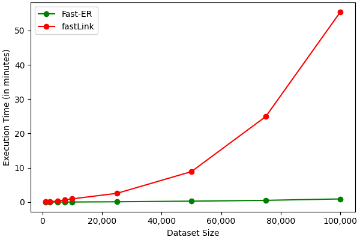
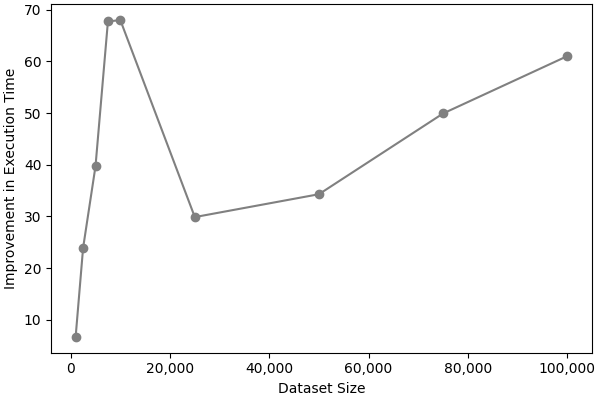

# Fast-ER: GPU-Accelerated Probabilistic Record Linkage in Python

**Authors:**
- [Jacob Morrier](https://www.jacobmorrier.com)
- [Sulekha Kishore](https://www.linkedin.com/in/sulekha-kishore/)
- [R. Michael Alvarez](https://www.rmichaelalvarez.com)

## Introduction

[Record linkage](https://en.wikipedia.org/wiki/Record_linkage), also called “entity resolution,” encompasses techniques for joining observations from two datasets that refer to the same unit or entity, even when the datasets do not share consistently formatted common identifiers.

Typically, record linkage involves computing string similarity metrics, such as the Jaro-Winkler metric, for all pairs of possible values across both datasets. While these calculations are simple, they become computationally expensive as the number of observations increases, causing the number of required comparisons to grow exponentially. For example, when linking observations from two datasets, each with 1,000,000 observations, adding just one more observation to either dataset results in an additional 1,000,000 comparisons. This makes record linkage prohibitively expensive to perform, even for datasets of moderate size.

To address this challenge, we propose to use graphical processing units (GPUs) to accelerate these computations. Originally designed for computer graphics and digital image processing, GPUs are also adept at performing parallel non-graphic calculations. This capability has been instrumental in advancing the field of artificial intelligence (AI). A growing number of software tools now support and facilitate the use of GPUs to accelerate data processing and other data science tasks. For instance, [RAPIDS](https://rapids.ai/) is an open-source suite of libraries developed by NVIDIA, a leading GPU manufacturer, leveraging CUDA-enabled GPUs to accelerate workflows in data processing, machine learning, and graph analytics. Similarly, [CuPy](https://cupy.dev/) is an open-source Python library designed to enable fast array-based numerical computations on GPUs.

Leveraging state-of-the-art GPU-accelerated computation tools, we have implemented the Fellegi-Sunter model, a widely used probabilistic record linkage model, along with the associated data processing tasks on CUDA-enabled GPUs. Our experiments demonstrate that this approach can accelerate the process by more than 60 times compared to the previous leading implementation ([fastLink](https://github.com/kosukeimai/fastLink/tree/master)). Importantly, this makes probabilistic record linkage methods more germane to large-size datasets. An open-source Python library accompanies this white paper.

## Description of the Fellegi-Sunter Model

Suppose we want to join observations from two data sets, $\mathcal{A}$ and $\mathcal{B}$, with sizes $N_\mathcal{A}$ and $N_\mathcal{B}$, respectively. Both datasets have $K$ variables in common. We evaluate all possible pairwise comparisons of the values for these variables. Specifically, for each of the $N_\mathcal{A} \times N_\mathcal{B}$ pairs of values, we define an agreement vector of length $K$, denoted $\mathbf{\gamma}_{ij}$. The $k^{\textrm{th}}$ element of this vector indicates the discrete level of similarity for the $k^{\textrm{th}}$ variable between the $i^{\textrm{th}}$ observation from dataset $\mathcal{A}$ and the $j^{\textrm{th}}$ observation from dataset $\mathcal{B}$.

We use the [Jaro-Winkler similarity metric](https://en.wikipedia.org/wiki/Jaro–Winkler_distance) to measure the similarity between two strings. The Jaro-Winkler similarity is a continuous measure that ranges from 0 to 1. We calculate the similarity between two strings, $s_1$ and $s_2$, using the following formula:

$$\mathcal{S}\left(s_1, s_2\right) = \mathcal{J}\left(s_1, s_2\right) + \ell \times w \times \left(1 - \mathcal{J}\left(s_1, s_2\right)\right),$$

where:

$$\mathcal{J}\left(s_1, s_2\right) = \frac{1}{3} \left( \frac{m}{\left|s_1\right|} + \frac{m}{\left|s_2\right|} + \frac{m-\frac{t}{2}}{m}\right).$$

In these equations, $\left|s\right|$ denotes the length of string $s$, $m$ is the number of matching characters between the strings, and $t$ is the number of transpositions between matching characters. Furthermore, $\ell$ (ranging from 0 to 4) represents the number of consecutive matching characters at the beginning of both strings, and $w$ (ranging from 0 to 0.25) is the weight assigned to $\ell$. We discretize the Jaro-Winkler similarity so that the values of the agreement vectors $\mathbf{\gamma}$ are integers between 0 and $L-1$, with higher integer values reflecting a greater similarity. In practice, we categorize the Jaro-Winkler similarity into three levels, using two thresholds to define these partitions.

The agreement vectors $\mathbf{\gamma}$ are used to estimate a naive Bayes latent variable model, which assigns weights to each variable based on its ability to distinguish between matches and non-matches. These weights are subsequently used to estimate the probability that two records refer to the same unit. In turn, this probability determines which observations are linked together.

Formally, the model presumes the existence of a latent variable $M_{ij}$, which indicates whether the pair of observations consisting of the $i^{\textrm{th}}$ observation from dataset $\mathcal{A}$ and the $j^{\textrm{th}}$ observation from dataset $\mathcal{B}$ constitutes a match.[^1] The model follows a simple finite mixture structure:

$$\gamma_{ij}\left(k\right) \sim \textrm{Discrete}\left(\mathbf{\pi}_{km}\right)$$

$$M_{ij} \sim \textrm{Bernoulli}\left(\lambda\right).$$

The vector $\mathbf{\pi}_{km}$, of length $L$, represents the probability of each discrete similarity level being observed for the $k^{\textrm{th}}$ variable conditional on whether the pair is a match ($m=1$) or not ($m=0$). The parameter $\lambda$ denotes the overall probability of a match across all pairwise comparisons. The model's estimands are the parameters $\lambda$ and $\mathbf{\pi}$. Once estimated, these parameters can be used to calculate the conditional match probability for all pairs of observations.

Calculating the Jaro-Winkler similarity between all pairs of values is highly amenable to parallelization because each pair is processed independently using the same instructions. Our main contribution consists in implementing this parallelization on GPUs.

[^1]: For a more detailed description and discussion fo the Fellegi-Sunter model, see this [paper](https://www.cambridge.org/core/journals/american-political-science-review/article/using-a-probabilistic-model-to-assist-merging-of-largescale-administrative-records/DB2955F64A1F4E262C5B9B26C6D7552E).

## Brief Description of General-Purpose Computing on Graphical Processing Units 

GPUs are specialized electronic circuits designed in the 1970s to enhance digital image processing. Unlike central processing units (CPUs), which are optimized for the rapid execution of sequential instructions, GPUs are designed to perform thousands of operations simultaneously. This parallelism makes them highly efficient for tasks that can be broken down into many smaller, simultaneous calculations, particularly those involving graphics. Early applications of GPUs focused on geometric transformations, such as rotating and translating vertices between coordinate systems, as well as texture mapping, where they could process large numbers of pixels concurrently.

GPUs are highly effective not only for graphics but also for non-graphical calculations. They are especially well-suited for high-throughput computations that involve data parallelism, where the same operations are applied to multiple data points simultaneously. This is due to the GPU's Single Instruction, Multiple Data (SIMD) architecture. In this context, GPUs are used as stream or vector processors, leveraging the immense computational power of modern shader pipelines to execute "compute kernels." These kernels are like the instructions in a "for loop," except that rather than being executed sequentially, they are executed concurrently across data points. The immense computation power of modern GPUs allows them to achieve performance levels that can be several orders of magnitude faster than traditional CPUs, particularly for applications involving extensive vector or matrix operations. 

## Storage and Manipulation of Strings with the Arrow Columnar Format

The main challenge in implementing the Jaro-Winkler similarity metric on GPUs, and more broadly in working with strings, stems from the fact that they do not natively support "arrays of arrays." Since a string is essentially an array of characters, an array of strings represents an array of arrays of characters. This limitation also affects "arrays of arrays" for other data types.

To overcome this limitation, we must convert "arrays of arrays" into a different data structure: the [Arrow columnar format](https://arrow.apache.org/docs/format/Columnar.html). In short, this approach consists of storing "arrays of arrays" in a primitive layout, which consists of a long array of contiguous values of the same data type and fixed memory size (e.g., a long array of characters), accompanied by a sequence of buffers that indicate the starting position of each element within the "array of arrays." For example, the array of strings `['David', 'Elizabeth', 'James', 'Jennifer', 'John', 'Linda', 'Mary', 'Michael', 'Patricia', 'Robert']` can be represented as an array of characters `['D', 'a', 'v', 'i', 'd', 'E', 'l', 'i', 'z', 'a', 'b', 'e', 't', 'h', 'J', 'a', 'm', 'e', 's', 'J', 'e', 'n', 'n', 'i', 'f', 'e', 'r', 'J', 'o', 'h', 'n', 'L', 'i', 'n', 'd', 'a', 'M', 'a', 'r', 'y', 'M', 'i', 'c', 'h', 'a', 'e', 'l', 'P', 'a', 't', 'r', 'i', 'c', 'i', 'a', 'R', 'o', 'b', 'e', 'r', 't']`, along with the following sequence of buffers, `[0, 5, 14, 19, 27, 31, 36, 40, 47, 55]`. These two arrays can be stored and manipulated by GPUs. After the appropriate code adjustments, this data structure proves highly flexible and easy to work with.

The Arrow columnar format is indispensable for storing and manipulating strings on GPUs. It also allows the management of the unique elements of an array on GPUs by enabling the storage and manipulation of their indices. These indices can subsequently be used to reconstruct the original array.

## Experiments

To illustrate the benefits of GPU-accelerated probabilistic record linkage, we compare the performance of our library with that of the previous leading implementation, fastLink. We undertake to join two excerpts of North Carolina voter registration rolls of varying sizes (from 1,000 to 100,000 observations) along four variables: first name, last name, house number, and street name. Each dataset contains 50% overlapping records. To create the need for probabilistic record linkage, we introduce noise into 5% of the records through various transformations: character addition, character deletion, random shuffling of values, replacing a character with another, and swapping two adjacent characters. These experiments confirm that our implementation of the Fellegi-Sunter probabilistic record linkage model is systematically faster than the previous leading implementation, achieving speed improvements of over 60 times.





| Package | Description of the Benchmarking Environment |
| :---: | --- |
| Fast-ER | Google Colab T4 GPU instance |
| fastLink | MacBook Pro 2021 with Apple M1 Pro Chip (10 CPU cores) and 32 GB unified memory |

## Documentation

<!--Placeholder for link to Read the Docs-->

The Fast-ER library consists of three classes, each corresponding to a stage in the probabilistic record linkage process. They are intended to be executed in sequence.

### Comparison Class

This class contains our primary contribution, as it performs the GPU-accelerated computation of the Jaro-Winkler similarity to compare each pair of values between two datasets.

`class Comparison(df_A, df_B, vars_A, vars_B)`

This class evaluates the similarity between the values in two datasets using the Jaro-Winkler metric.

**Parameters:**
- `df_A` (*Pandas DataFrame*): First dataframe to compare.
- `df_B` (*Pandas DataFrame*): Second dataframe to compare.
- `vars_A` (*array_like*): Names of variables to compare in `df_A`.
- `vars_B` (*array_like*): Names of variables to compare in `df_B`. The variables must be listed in the same order as in `vars_A`.

**Attributes:**
- `Indices` (*list of CuPy arrays*): This list contains the indices of pairs of records in `df_A` and `df_B` corresponding to each pattern of discrete levels of similarity across variables. The indices represent `i * len(df_B) + j`, where `i` is the element's index in `df_A` and `j` is the element's index in `df_B`.
- `Counts` (*NumPy array*): This array contains the count of observations for each pattern of discrete levels of similarity across variables.

`fit(Lower_Thr = 0.88, Upper_Thr = 0.94, Num_Threads = 256)`

This method calculates the Jaro-Winkler similarity for every pair of observations across all variables.

**Parameters:**
- `Lower_Thr` (*float, default = 0.88*): Lower threshold for discretizing the Jaro-Winkler similarity.
- `Upper_Thr` (*float, default = 0.94*): Upper threshold for discretizing the Jaro-Winkler similarity.
- `Num_Threads` (*int, default = 256*): Number of threads per block. The maximal possible value is 1,024.

### Estimation Class

`class Estimation(K, Counts, L = 3)`

This class estimates the parameters of the Fellegi-Sunter model given the observed patterns of discrete levels of similarity across variables.

**Parameters:**
- `K` (*int*): Number of variables compared.
- `Counts` (*NumPy array*): This array contains the count of observations for each pattern of discrete levels of similarity across variables.
- `L` (*int, default = 3*): Number of discrete levels the similarity can take.

**Attributes:**
- `Gamma` (*Tensor*): This three-dimensional tensor encodes all the observed patterns of discrete levels of similarity across variables.
  - The first dimension indexes the patterns.
  - The second dimension represents the variable.
  - The third dimension represents the discrete level of similarity taken by the variable.
- `Lambda` (*float*): Match probability.
- `Pi` (*Tensor*): This three-dimensional tensor contains the probability of observing each discrete level of similarity for each variable conditional on the latent state (i.e., match or no match).
  - The first dimension represents the variable.
  - The second dimension represents the discrete level of similarity.
  - The third dimension represents the latent state.
- `Ksi` (*NumPy array*): This array contains the conditional match probabilities for each pattern of discrete levels of similarity across variables.

`fit(Tolerance = 1e-4, Max_Iter = 500)`

This method estimates the parameters of the Fellegi-Sunter model using the Expectation-Maximization (EM) algorithm.

**Parameters:**
- `Tolerance` (*float, default = 1e-4*): This parameter governs the convergence of the EM algorithm: convergence is achieved when the largest change in `Pi` is smaller than the value of this parameter.
- `Max_Iter` (*float, default = 500*): This parameter determines the maximal number of iterations of the EM algorithm.

### Linkage Class

`class Linkage(df_A, df_B, Indices, Ksi)`

This class links the records in two data frames based on previously estimated conditional match probabilities.

**Parameters:**
- `df_A` (*Pandas DataFrame*): First dataframe to link.
- `df_B` (*Pandas DataFrame*): Second dataframe to link.
- `Indices` (*list of CuPy arrays*): This list contains the indices of pairs of records in `df_A` and `df_B` corresponding to each pattern of discrete levels of similarity across variables.
- `Ksi` (*NumPy array*): This array contains the conditional match probabilities for each pattern of discrete levels of similarity across variables.

`transform(Threshold = 0.5)`

**Parameters:**
- `Threshold` (*float, default = 0.5*): This is the threshold above which pairs of observations in `df_A` and `df_B` must be linked. Its value must be between 0 and 1.

**Returns:**
- `df_linked` (*Pandas DataFrame*): A data frame in which all pairs of records in `df_A` and `df_B` with a conditional match probability above the threshold are linked.

## Example

To install the library from this repository, execute the following command:
```python
!pip install git+https://github.com/jacobmorrier/fast-er.git#egg=fast-er

import importlib
faster = importlib.import_module("fast-er")
```

Here is an example of a standard probabilistic record linkage pipeline, using the previously described classes:
```python
# Comparison Class
vars = ['last_name', 'first_name', 'house_number', 'street_address']

comp = faster.Comparison(df_A, df_B, vars, vars)

comp.fit()

# Estimation Class
est = faster.Estimation(len(vars), comp.Counts)

est.fit()

#Linkage Class
link = faster.Linkage(df_A, df_B, comp.Indices, est.Ksi)

df_linked = link.transform()
```

> [!TIP]
> Ensure that the variables you intend to link are formatted as strings.

## Conclusion

The library we are releasing today is intended to evolve and grow with new features over time. Some of the planned enhancements include:
- A dedicated class for dataset deduplication.
- A class for evaluating the performance and accuracy of the estimates generated by the Fellegi-Sunter model.
- Support for multiple GPUs.
