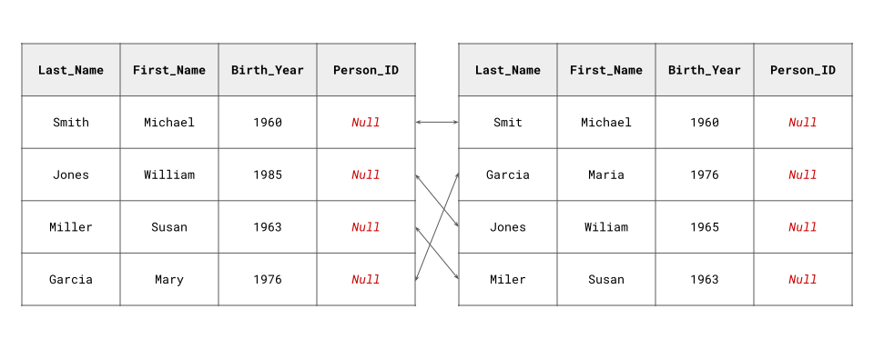

# Fast-ER: GPU-Accelerated Record Linkage and Deduplication in Python

**Authors:**
- [Jacob Morrier](https://www.jacobmorrier.com)
- [Sulekha Kishore](https://www.linkedin.com/in/sulekha-kishore/)
- [R. Michael Alvarez](https://www.rmichaelalvarez.com)

Fast-ER is a Python package for GPU-accelerated record linkage and deduplication.

## Key Features

- Harnesses the computational power of **CUDA-enabled GPUs** to dramatically accelerate record linkage and deduplication.
- Achieves speeds over 35 times **faster** than the leading CPU-powered software implementation.
- Enhances the **scalability** of record linkage and deduplication for moderate to large datasets.

## What Are Record Linkage and Deduplication?

Suppose you have two datasets like those illustrated below:

Both datasets contain matching entries, but they lack a common unique identifier over which a direct "hard" join could be performed. Moreover, inconsistencies in other variables make a merge based solely on their values unreliable.

[Record linkage](https://en.wikipedia.org/wiki/Record_linkage) addresses this issue by comparing the values of all record pairs from both datasets using string similarity metrics, which continuously measure how alike two strings are. These similarity scores are then fed into a probabilistic model that estimates the likelihood that any pair of entries represent the same entity. This approach allows to identify records that refer to the same entity, even when none of their values match perfectly.

A similar approach can be used for deduplication within a single dataset, when "hard" deduplication fails due to the absence of a unique identifier or inconsistencies in the data.

## Why GPU Acceleration?

Record linkage and deduplication involve calculating string similarity metrics, such as the [Jaro-Winkler metric](https://en.wikipedia.org/wiki/Jaro–Winkler_distance), across all pairs of records between two datasets or within a single dataset. While each individual calculation is simple, the number of comparisons grows quadratically with dataset size. For example, when linking two datasets with 1,000,000 records each, adding a single record to either dataset generates 1,000,000 additional comparisons. This quickly renders record linkage and deduplication prohibitively expensive, even for moderately sized datasets.

GPUs excel at these high-throughput, data-parallel computations. By offloading string similarity calculations to GPUs, Fast-ER can reduce execution times from hours to minutes, enabling large-scale record linkage and deduplication that would otherwise be impractical.

## How to Contribute

We welcome contributions! You can help by:
- Submitting [pull requests](https://github.com/jacobmorrier/fast-er/pulls).
- Opening [issues](https://github.com/jacobmorrier/fast-er/issues) for feature suggestions, bug reports, or support requests.
