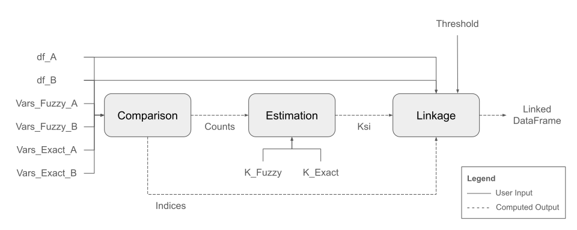
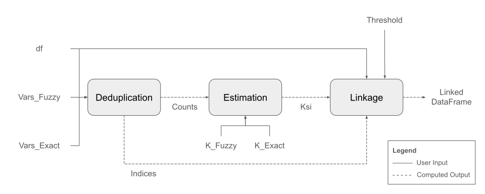

Package Architecture
====================

The package contains classes designed to serve as modules within record linkage and deduplication pipelines, customizable to your needs and requirements. Each class demands user-supplied inputs and produces relevant outputs, some of which must be passed to other classes for additional processing.

Below are two figures illustrating standard record linkage and deduplication pipelines using Fast-ER’s classes.

Record Linkage
--------------

We begin by describing the record linkage pipeline. Record linkage consists of identifying matching observations in two datasets based on the similarity of their values across some variables.

The process begins by supplying the following inputs to the :doc:`Comparison <comparison>` class: (i) two datasets (``df_A`` and ``df_B``), (ii) variables to compare for fuzzy matching (``Vars_Fuzzy_A`` and ``Vars_Fuzzy_B``), and (iii) variables to compare for exact matching (``Vars_Exact_A`` and ``Vars_Exact_B``). The class then compares the values of all pairs of observations in both datasets, producing an array with the count of each pattern of discrete similarity levels across all variables stored in the ``Counts`` attribute. This array is the main input to the :doc:`Estimation <estimation>` class, which uses it to estimate the conditional match probability for each pattern of discrete similarity levels across all variables. In turn, along with the list of indices corresponding to each pattern from the :doc:`Comparison <comparison>` class, this information is the main input to the :doc:`Linkage <linkage>` class, which generates a dataset containing all pairs of observations with a conditional match probability above a user-specified threshold.

.. note:: A pattern of similarity levels encodes the level of similarity between the two observations in a pair across all variables being compared. It can be conceptualized as a vector in which each element corresponds to the pair’s discrete level of similarity over a given variable.

Deduplication
-------------

Next, we describe the deduplication pipeline. The objective of deduplication is to identify matching observations in a single dataset based on the similarity of their values across some variables.

The process begins by supplying the following inputs to the :doc:`Deduplication <deduplication>` class: (i) a dataset (``df``), (ii) variables to compare for fuzzy matching (``Vars_Fuzzy``), and (iii) variables to compare for exact matching (``Vars_Exact``). The class then compares the values of all pairs of observations in the dataset, producing an array with the count of each pattern of discrete similarity levels across all variables stored in the ``Counts`` attribute. This array is the main input to the :doc:`Estimation <estimation>` class, which uses it to estimate the conditional match probability for each pattern of discrete similarity levels across all variables. In turn, along with the list of indices corresponding to each pattern from the :doc:`Deduplication <deduplication>` class, this information is the main input to the :doc:`Linkage <linkage>` class, which generates a dataset containing all pairs of observations with a conditional match probability above a user-specified threshold.
