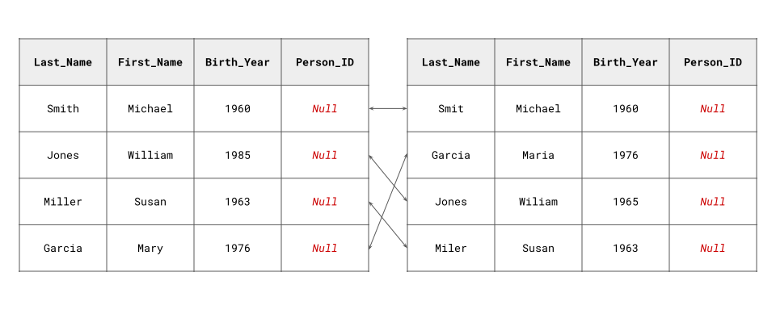

Fast-ER: GPU-Accelerated Record Linkage and Deduplication in Python
===================================================================

.. toctree::
   :hidden:

   installation
   architecture
   usage

.. toctree::
   :caption: API Documentation
   :hidden:

   comparison
   deduplication
   estimation
   linkage
   evaluation

.. image:: https://readthedocs.org/projects/fast-er/badge/?version=latest
    :target: https://fast-er.readthedocs.io/en/latest/?badge=latest
    :alt: Documentation Status

**Authors:**

- `Jacob Morrier <https://www.jacobmorrier.com>`_
- `Sulekha Kishore <https://www.linkedin.com/in/sulekha-kishore/>`_
- `R. Michael Alvarez <https://www.rmichaelalvarez.com>`_

Fast-ER is a Python package for GPU-accelerated record linkage and deduplication.

.. button-link:: https://github.com/jacobmorrier/fast-er
    :color: primary
    :expand:

   Visit Our GitHub Repository

Key Features
------------

- Harnesses the power of **CUDA-enabled GPUs** to dramatically accelerate record linkage and deduplication
- Achieves speeds over 35 times **faster** than the leading CPU-powered software implementation
- Enhances the **scalability** of record linkage and deduplication for moderate to large datasets

What Are Record Linkage and Deduplication?
------------------------------------------

Imagine you have two datasets like those illustrated below:

As shown by the arrows, both datasets contain matching entries. However, they lack a common unique identifier over which we could perform a direct "hard" join. Moreover, inconsistencies in other variables prevent a reliable merge based solely on their values.

`Record linkage <https://en.wikipedia.org/wiki/Record_linkage>`_ solves this issue by comparing the values across all pairs of entries from both datasets using string similarity metrics. The latter provide a continuous measure of similarity between any two strings. The results are passed on to a probabilistic model, which estimates the likelihood that each pair refers to the same unit. This approach helps to identify records that refer to the same entity, even when none of their values match perfectly.

A similar approach can be used to deduplicate entries within a dataset when "hard" deduplication may fail due to the absence of a unique identifier and inconsistencies in some variables.

Why GPU Acceleration?
---------------------

Record linkage and deduplication often involve calculating string similarity metrics, such as the `Jaro-Winkler metric <https://en.wikipedia.org/wiki/Jaro–Winkler_distance>`_, for all pairs of values between two datasets or within a single dataset. While these calculations are simple, the number of comparisons grows exponentially with the size of the datasets. For instance, when linking entries of two datasets with 1,000,000 observations each, adding just one more observation to either dataset results in an additional 1,000,000 comparisons. This renders record linkage and deduplication prohibitively expensive, even for datasets of moderate size.

GPUs excel at high-throughput computations that can be broken down into identical, independent tasks, such as those exhibiting data parallelism. For such tasks, GPUs can achieve performance levels that are orders of magnitude faster than traditional CPUs. Calculating string similarity metrics across numerous pairs of values is a prime example of this type of operation. By reducing execution time, we aim to enhance the scalability of record linkage and deduplication for moderate to large datasets.
